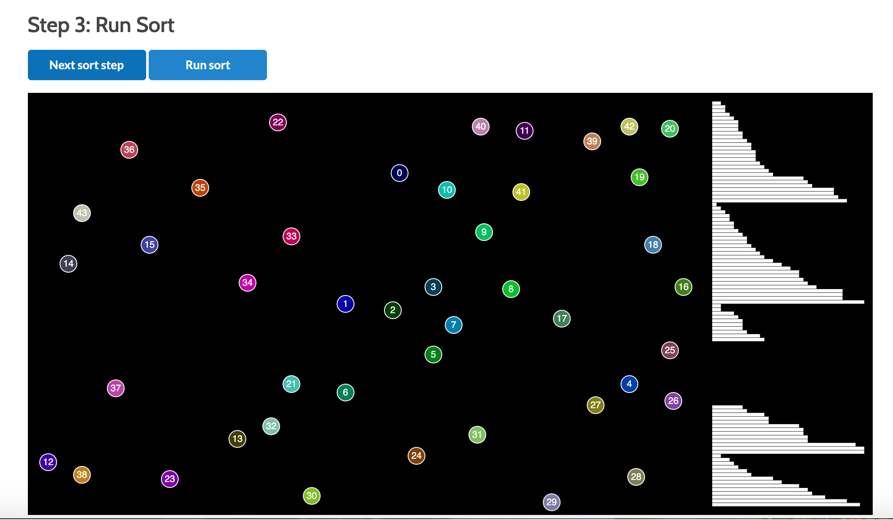
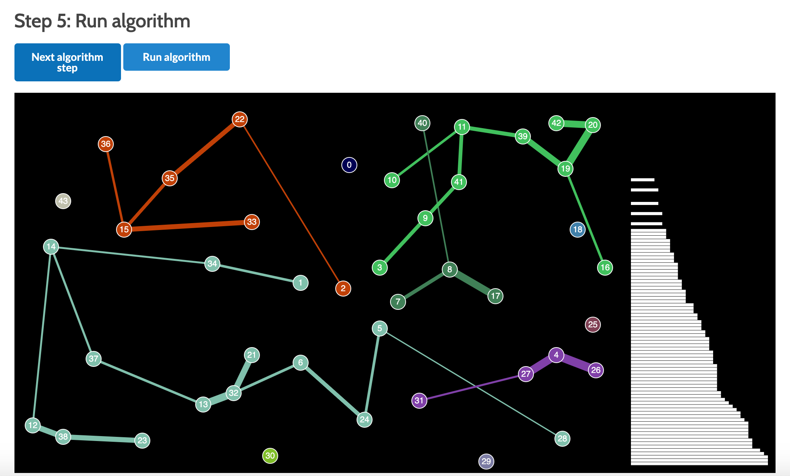
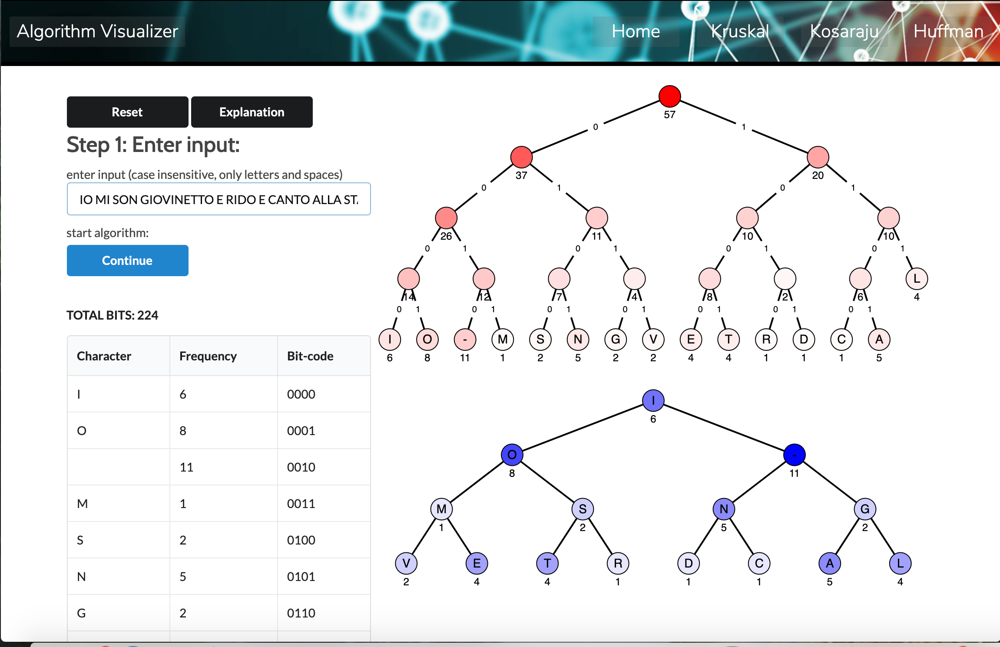
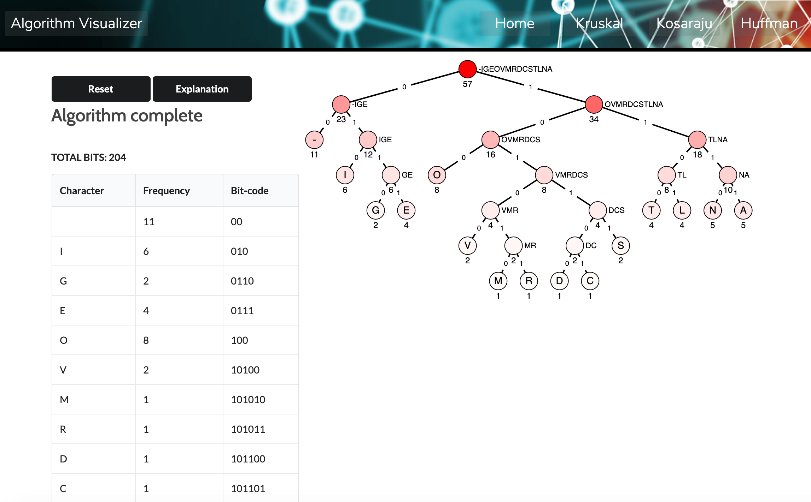

## Live Demo

View the project on **heroku** [here](https://floating-plains-07920.herokuapp.com/) (initial load my take a minute)

## Overview

This frontend **React** application shows detailed visualzations of two graph algorithms: [**Kruskal**](https://en.wikipedia.org/wiki/Kruskal's_algorithm) and [**Kosaraju-Shahrir**](https://en.wikipedia.org/wiki/Kosaraju%27s_algorithm) as well as [**Huffman's encoding algorithm**](https://en.wikipedia.org/wiki/Huffman_coding#Compression).  The visualizations all take input data that is either entered by users or else is editable by users.  Users can also select various options for the algorithms (such as sort methods) that affect the run time.  The visualizations are a powerful tool for understanding the way these algorithms all use specific data structures to optimize run times for certain kinds of problems.

The visualization displays are rendered without the help of any data-visualization library like D3 JS but rather simply rely on the **P5 JS** library in conjunction with the **React P5 Wrapper.**  The input data as well as the precise values of the data structures during the course of each algorithm are stored using **Redux.**  The buttons and forms are rendered with the **Semantic UI** library while the simple animation on the home page was created using plain CSS and javaScript.

## Instructions

The app works on mobile but is best viewed on a desktop since the ability to edit the input graphs in the Kosaraku and Kruskal algorithm relies on mouse inputs for dragging, &c.  For the Kruskal and Kosaraju algorithms, the default input is a small graph, but the algorithms are best viewed with the large inputs.  In both of them, the graph can be edited by moving the nodes as well as adding and deleting nodes and edges.  At each step of the algorithm, users can choose between running one step at a time (in which case the smaller input data is recommended) or running the entire phase at once.

## Constraints

1. The Huffman algorithm is case-insensitive and only allows for letters and the space.  Limiting the number of characters to 27 keeps the tree size manageable for the purpose of the visualization.

2. The program must actually run and solve the Kosaraju algorithm before the final stage of the visualization can begin.  This is so the number of Strongly Connected Components can be known ahead of time so that individual Strongly Connected Components can be colored as the algorithm unfolds such that the colors are evenly distributed across the rgb cube.

## Where to find the most interesting code in this repository

* To see how the trees in the Huffman algorithm are rendered at any given stage, see [this code](https://github.com/ZalmanKelber/Algorithms/blob/master/src/utils/sketchFunctions/drawTree.js) and [this code](https://github.com/ZalmanKelber/Algorithms/blob/master/src/utils/sketchFunctions/drawCirclesHuffman.js)

* To see how the next step of the Kosaraju algorithm and sent to the Redux store, see [this code](https://github.com/ZalmanKelber/Algorithms/blob/master/src/utils/changeStore/nextKosarajuStep.js)

* To see how a given number of colors are found such that they are evenly distributed across the rgb cube, see [this code](https://github.com/ZalmanKelber/Algorithms/blob/master/src/utils/miscellaneous/generateColors.js)

## Issues and Bugs

* The individual algorithms can't be reset to their starting positions after being completed without refreshing the page.  This seems to be because of improper updating of the Redux Store at various stages of the application.

## Future steps

* Consider turning the generateColors function into its own repository available for download and instillation using npm for reuse in different projects.
